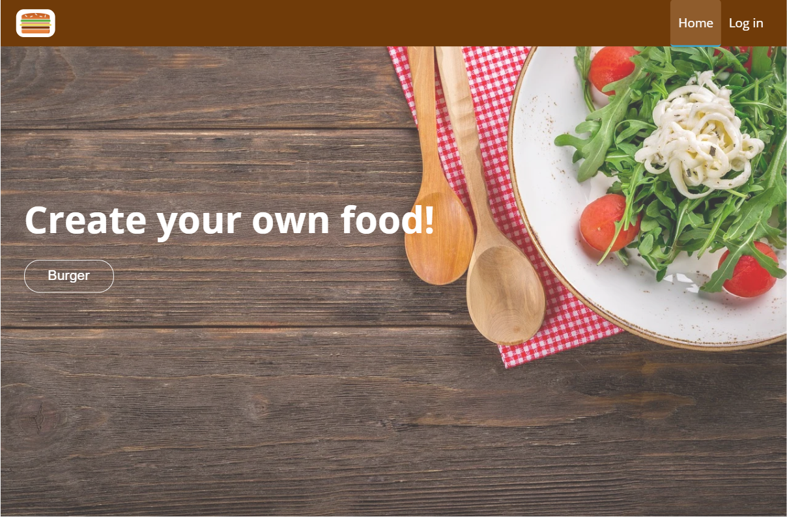
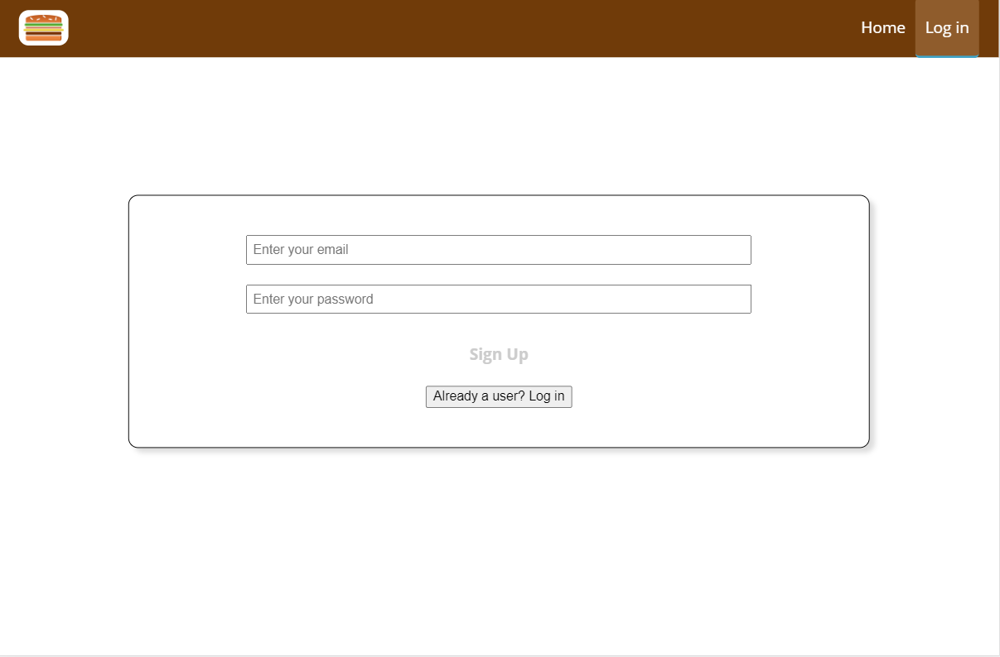
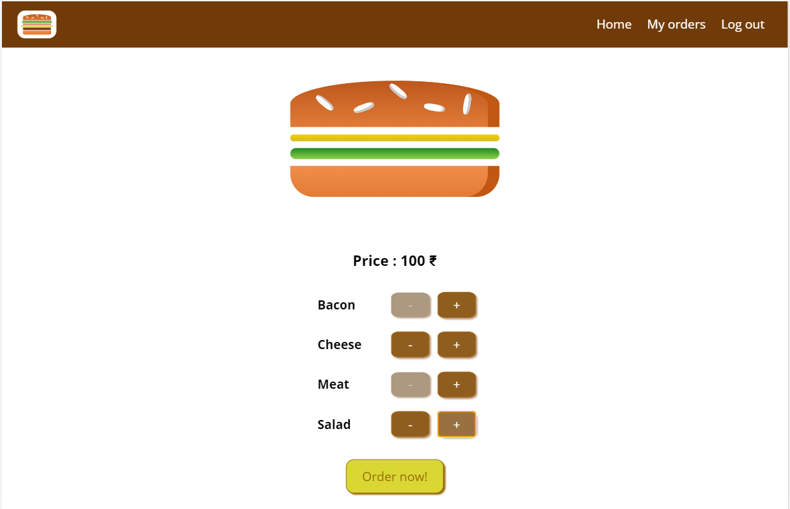
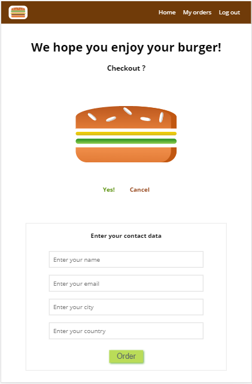

## Project description :

This application allows the user to add ingredients to the burger using an interactive UI. The user, once logged in, can then checkout and order his / her food.
It is built using **React, Redux and Firebase ( for database, authentication and hosting )**

## Project preview : 
#### https://food-ordering-app-80e61.web.app/

## Snapshots:

#### HomePage:

#### Auth Page

#### Main page

#### Checkout page

